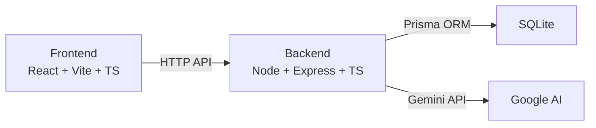
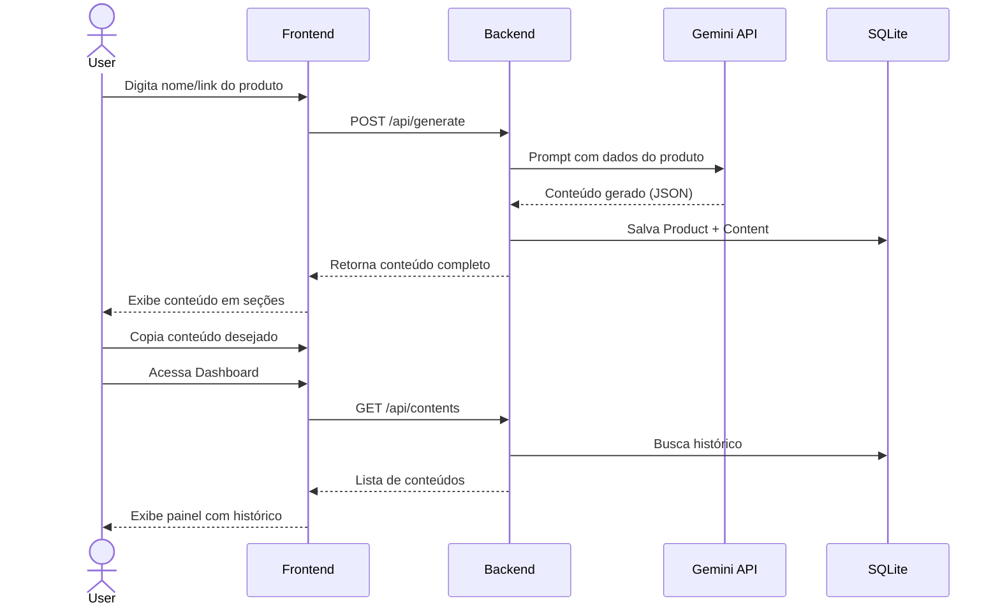

Gerador de Conteúdo para E-commerce com IA
Um sistema full-stack que recebe o nome ou link de um produto e usa IA (Google Gemini) para gerar automaticamente: títulos otimizados, descrições para Mercado Livre/Shopee, palavras-chave e posts para Instagram. Todo conteúdo é salvo em um painel para consulta e reutilização.

          

User Review Required
> [!IMPORTANT]
> [!NOTE]
> Escopo inicial: O plano foca na versão MVP funcional. Funcionalidades como autenticação de usuário, scraping automático de links e exportação em massa podem ser adicionadas depois.
Arquitetura Geral

Stack Tecnológica
Camada	Tecnologia	Motivo
Frontend	React 18 + TypeScript + Vite	Rápido, moderno, tipado
Estilo	CSS puro Controle total, sem dependência
Backend	Node.js + Express + TypeScript	Simples, robusto, tipado
Banco SQLite + Prisma ORM Zero config, migrations fáceis
IA	Google Gemini API (`@google/genai`)	
HTTP Client	Axios (frontend) Interceptors, tipagem
Estrutura do Projeto
```
ecommerce-content-generator\
├── client/                          # Frontend React
│   ├── public/
│   ├── src/
│   │   ├── components/
│   │   │   ├── Header.tsx           # Navbar com logo e navegação
│   │   │   ├── ProductForm.tsx      # Formulário de input (nome/link)
│   │   │   ├── ContentCard.tsx      # Card de conteúdo gerado
│   │   │   ├── GeneratedContent.tsx # Painel com todo conteúdo gerado
│   │   │   ├── HistoryList.tsx      # Lista de gerações anteriores
│   │   │   ├── InstagramPreview.tsx # Preview visual do post Instagram
│   │   │   ├── KeywordBadges.tsx    # Tags visuais de palavras-chave
│   │   │   ├── CopyButton.tsx       # Botão de copiar com feedback
│   │   │   └── LoadingSpinner.tsx   # Animação de loading
│   │   ├── pages/
│   │   │   ├── HomePage.tsx         # Página principal (gerar conteúdo)
│   │   │   └── DashboardPage.tsx    # Painel com histórico salvo
│   │   ├── services/
│   │   │   └── api.ts               # Client HTTP (Axios)
│   │   ├── types/
│   │   │   └── index.ts             # Tipos TypeScript compartilhados
│   │   ├── App.tsx                   # Rotas e layout
│   │   ├── index.css                # Design system + estilos globais
│   │   └── main.tsx                 # Entry point
│   ├── index.html
│   ├── package.json
│   ├── tsconfig.json
│   └── vite.config.ts
│
├── server/                          # Backend Node.js
│   ├── prisma/
│   │   └── schema.prisma            # Schema do banco de dados
│   ├── src/
│   │   ├── routes/
│   │   │   └── content.ts           # Rotas da API REST
│   │   ├── services/
│   │   │   ├── gemini.ts            # Integração com Gemini API
│   │   │   └── contentGenerator.ts  # Lógica de geração de conteúdo
│   │   ├── types/
│   │   │   └── index.ts             # Tipos do servidor
│   │   └── index.ts                 # Entry point do Express
│   ├── package.json
│   └── tsconfig.json
│
├── .env                             # GEMINI_API_KEY=sua_chave_aqui
└── README.md
```
Schema do Banco de Dados (Prisma)
```prisma
model Product {
  id          String   @id @default(cuid())
  name        String               // Nome do produto
  link        String?              // Link opcional
  createdAt   DateTime @default(now())
  contents    Content[]
}

model Content {
  id              String   @id @default(cuid())
  productId       String
  product         Product  @relation(fields: [productId], references: [id], onDelete: Cascade)
  title           String               // Título otimizado
  descriptionML   String               // Descrição Mercado Livre
  descriptionShopee String             // Descrição Shopee
  keywords        String               // JSON array de palavras-chave
  instagramPost   String               // Texto do post Instagram
  instagramHashtags String             // Hashtags do Instagram
  createdAt       DateTime @default(now())
}
```
API REST Endpoints
Método	Rota	Descrição
`POST`	`/api/generate`	Recebe `{ name, link? }`, chama Gemini, salva e retorna conteúdo
`GET`	`/api/contents`	Lista todos os conteúdos gerados (dashboard)
`GET`	`/api/contents/:id`	Detalhe de um conteúdo específico
`DELETE`	`/api/contents/:id`	Remove um conteúdo do histórico
Proposed Changes
1. Backend — Server Setup
[NEW] server/package.json
Dependências: `express`, `cors`, `@google/genai`, `@prisma/client`, `dotenv`, `zod`
Dev: `typescript`, `tsx`, `prisma`, `@types/*`
[NEW] server/tsconfig.json
Config TypeScript para Node.js com ES modules.
[NEW] server/prisma/schema.prisma
Schema com modelos `Product` e `Content` conforme descrito acima.
[NEW] server/src/index.ts
Express server na porta 3001
Middleware: `cors`, `express.json()`
Monta rotas `/api`
---
2. Backend — Serviço de IA (Gemini)
[NEW] server/src/services/gemini.ts
Inicializa client `@google/genai` com a API key do `.env`
Função `generateEcommerceContent(productName, productLink?)` que:
Monta um prompt detalhado pedindo ao Gemini para gerar:
Título otimizado (SEO, 60-80 chars, com palavras-chave)
Descrição Mercado Livre (formato com emojis, bullets, benefícios, especificações)
Descrição Shopee (formato mais curto, persuasivo)
10 palavras-chave relevantes para busca
Post Instagram (texto + 30 hashtags relevantes)
Retorna JSON estruturado parseado
[NEW] server/src/services/contentGenerator.ts
Orquestra a chamada ao Gemini + salvamento no banco via Prisma
Validação de input com Zod
---
3. Backend — Rotas
[NEW] server/src/routes/content.ts
`POST /api/generate` — Valida input, chama `contentGenerator`, retorna resultado
`GET /api/contents` — Lista com paginação e ordenação por data
`GET /api/contents/:id` — Busca por ID
`DELETE /api/contents/:id` — Soft delete ou hard delete
---
4. Frontend — Setup
[NEW] client/package.json
Dependências: `react`, `react-dom`, `react-router-dom`, `axios`, `react-icons`
Dev: `typescript`, `vite`, `@vitejs/plugin-react`, `@types/*`
[NEW] client/vite.config.ts
Proxy `/api` → `http://localhost:3001` para desenvolvimento
[NEW] client/src/types/index.ts
Tipos `Product`, `Content`, `GenerateRequest`, `GenerateResponse`
[NEW] client/src/services/api.ts
Axios instance com baseURL
Funções: `generateContent()`, `getContents()`, `getContent()`, `deleteContent()`
---
5. Frontend — Design System & Estilos
[NEW] client/src/index.css
Design premium com:
Tema escuro com gradientes sutis (deep purple → dark blue)
Glassmorphism nos cards
Variáveis CSS para cores, espaçamentos, bordas
Animações: fade-in, slide-up, pulse no loading, hover effects
Tipografia: Google Fonts (Inter)
Responsivo: Mobile-first com breakpoints
---
6. Frontend — Componentes
[NEW] client/src/components/Header.tsx
Logo com ícone + nome do app
Navegação: "Gerar" | "Dashboard"
Efeito glassmorphism + blur no scroll
[NEW] client/src/components/ProductForm.tsx
Input para nome do produto (obrigatório)
Input para link (opcional)
Botão "Gerar Conteúdo" com loading state
Validação visual
[NEW] client/src/components/GeneratedContent.tsx
Layout em tabs/seções:
 Título Otimizado — com botão copiar
 Mercado Livre — descrição formatada com botão copiar
 Shopee — descrição formatada com botão copiar
 Palavras-chave — badges visuais clicáveis
 Instagram — preview visual + texto + hashtags
Cada seção com `CopyButton`
[NEW] client/src/components/InstagramPreview.tsx
Mockup visual de post Instagram
Exibe texto formatado + hashtags separadas
Contador de caracteres
[NEW] client/src/components/KeywordBadges.tsx
Palavras-chave como badges coloridas
Clique para copiar individual
Botão "Copiar todas"
[NEW] client/src/components/CopyButton.tsx
Ícone de clipboard → check com animação
Tooltip "Copiado!" com fade
[NEW] client/src/components/ContentCard.tsx
Card para o dashboard com preview resumido
Nome do produto, data, ações (ver, deletar)
[NEW] client/src/components/HistoryList.tsx
Grid/lista de `ContentCard`
Busca/filtro por nome
Ordenação por data
Estado vazio com ilustração
[NEW] client/src/components/LoadingSpinner.tsx
Animação de loading elegante durante geração
---
7. Frontend — Páginas
[NEW] client/src/pages/HomePage.tsx
Hero section com título e subtítulo
`ProductForm` centralizado
`GeneratedContent` aparece abaixo após geração
Animação de transição entre estados
[NEW] client/src/pages/DashboardPage.tsx
Header com stats (total de gerações)
`HistoryList` com todos os conteúdos salvos
Click abre modal/página com detalhes completos
[NEW] client/src/App.tsx
React Router com rotas `/` e `/dashboard`
Layout com `Header` fixo
---
8. Configuração
[NEW] .env
```
GEMINI_API_KEY=sua_chave_aqui
```
[NEW] README.md
Instruções de setup, instalação e uso
---
Fluxo do Usuário

Verification Plan
Automated Tests
Iniciar o servidor backend e verificar que responde em `/api/contents`
Rodar `npx prisma db push` e verificar que o banco é criado
Build do frontend sem erros: `npm run build`
Manual Verification
Iniciar backend (`npm run dev` na pasta server)
Iniciar frontend (`npm run dev` na pasta client)
Digitar um produto de teste (ex: "Fone Bluetooth JBL")
Verificar que o Gemini retorna conteúdo estruturado
Verificar botões de copiar funcionam
Verificar que aparece no Dashboard
Testar deletar um conteúdo
Testar responsividade no mobile

Tela Inicial.

Gerando Informações.

Informações.


